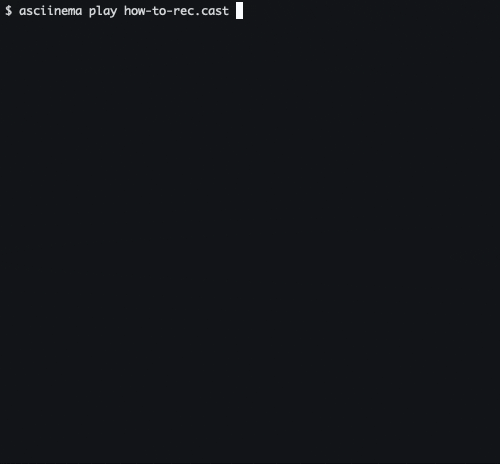
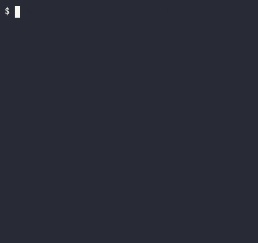
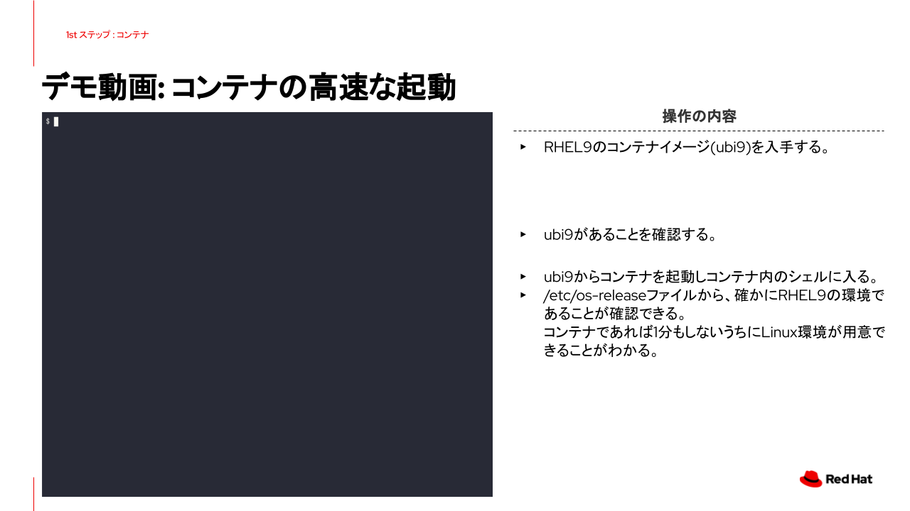
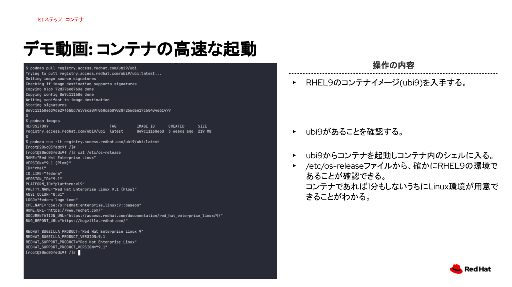
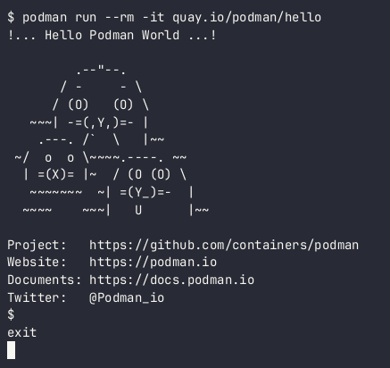
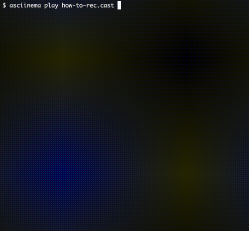

# ターミナル操作のデモ動画作成、編集

## このリポジトリについて
- ターミナル操作を録画してデモ動画を作成する手順の解説とサンプルコードを用意しました
- 操作はすべてCLIで完結できます。また操作に必要なツール類をコンテナで実行することでローカル環境へのインストールは不要です（asciinema除く）。
- Google SlidesやPowerPointなどにGIFファイルを埋め込んだ場合の印刷対応を追加しています

## 動画作成、編集のワークフロー

1. [asciinema](https://github.com/asciinema/asciinema)を使用してターミナル操作を録画
2. `.cast`ファイルの直接編集、または[asciinnema-trim](https://github.com/suzuki-shunsuke/asciinema-trim)を使用した録画の編集
3. [agg](https://github.com/asciinema/agg)を使用して`.cast`をGIFファイルに変換
4. (印刷対応)最終フレームを動画の先頭にコピーする
5. 完成したGIFファイルをGoogle Slidesに読み込み

このリポジトリでは上記の1〜４までを対象範囲とします。

## 環境

### 動作確認環境

- macOS Ventura(13.3.1), Podman v4.5.0
- Fedora 38, Podman v4.5.0

### 各ツールのパッケージインストール対応状況
| Method| Mac| Fedora| 備考|
|:-|:-|:-|:-|
| asciinema| brew| dnf| コンテナ実行はできないのでローカルインストール必須|
| asciinema-trim| brew(*1)| brew(*1)| (*1)入手方法はGitHubリポジトリを参照|
| agg| -| -| セルフビルドするかGitHubリポジトリからダウンロード|
| ffmpeg| brew| dnf(*2)| (*2)[rpmfusion](https://rpmfusion.org/)を利用|
| convert| brew| dnf| ImageMagickに同梱|

- `asciinema`をのぞして各ツールをコンテナで実行する方法があります
- 実行方法は後述のコンテナで実行する方法を参照

---

## 0. Gitリポジトリのクローン

```
git clone https://github.com/tnk4on/terminal-demo-video.git
cd terminal-demo-video
```

## 1. ターミナル操作の録画（asciinema）

### 1.1 操作の録画

`asciinema rec` コマンドを使用して録画します。

```
asciinema rec <filename>.cast
```

- 任意の名前でファイル名を指定して保存できます
- 「ctrl + d」を押して録画を終了します

<デモ>


### 1.2 録画の再生

`asciinema play` コマンドを使用して録画します。

```
asciinema play how-to-rec.cast
```



### 1.3 Tips
- Linuxのプロンプト変更
    - CLI操作の録画時に、余計なプロンプトを表示させないように最低限の表示のみに変更します
    - 実行中のセッションで適用しても`asciinema`実行時に解除されてしまうため、`.bashrc` や`.zshrc`などに下記を追記します
```
export PS1="$ "
```

## 2. 動画の編集
### 2.1 `.cast`ファイルの直接編集

`.cast`はテキストファイルのため、任意のエディタで編集できます。
- 不要な行を消すことでカット編集ができます
    - カットした部分の時間を詰める場合は次に紹介する`asciinema-trim`を使用します
- 最終行は録画停止時の`exit`が入ることがあるので、不要な場合は消すことができます

<`how-to-rec.cast`の中身>
```
{"version": 2, "width": 272, "height": 63, "timestamp": 1682583425, "env": {"SHELL": "/bin/bash", "TERM": "xterm-256color"}}
[0.035087, "o", "\u001b]0;root@fedora-server:~/tmp\u0007"]
[0.036084, "o", "\u001b[?2004h$ "]
[1.030083, "o", "\u001b[7mpodman run --rm -it quay.io/podman/hello\u001b[27m"]
[1.658674, "o", "\r\u001b[C\u001b[Cpodman run --rm -it quay.io/podman/hello\r\n\u001b[?2004l\r"]
[1.83523, "o", "!... Hello Podman World ...!\r\n\r\n         .--\"--.           \r\n       / -     - \\         \r\n      / (O)   (O) \\        \r\n   ~~~| -=(,Y,)=- |         \r\n    .---. /`  \\   |~~      \r\n ~/  o  o \\~~~~.----. ~~   \r\n  | =(X)= |~  / (O (O) \\   \r\n   ~~~~~~~  ~| =(Y_)=-  |   \r\n  ~~~~    ~~~|   U      |~~ \r\n\r\nProject:   https://github.com/containers/podman\r\nWebsite:   https://podman.io\r\nDocuments: https://docs.podman.io\r\nTwitter:   @Podman_io\r\n"]
[2.075919, "o", "\u001b]0;root@fedora-server:~/tmp\u0007\u001b[?2004h$ "]
[3.27779, "o", "\u001b[?2004l\r\r\nexit\r\n"]
```


### 2.2 `asciinema-trim`を使用した編集

`asciinema-trim`を使用すると`.cast`の直接編集ではできないカット編集による時間を詰めることができます。詳細な使用方法は下記の記事を参照。

[asciinema-trim - asciinema の session をトリミングする CLI](https://zenn.dev/shunsuke_suzuki/articles/asciinema-trim)


## 3. GIFファイルへの変換

`agg`コマンドを使用して録画した`.cast`ファイルをGIFファイルに変換します

```
agg how-to-rec.cast how-to-rec_no-option.gif   
```

オプション無しで変換すると巨大なサイズになってしまい文字が読めません。


`--cols`と`--rows`オプションを付けることで適切なサイズにトリミングすることができます。
- `--cols`：横の文字数
- `--rows`：縦の行数

```
agg --cols 50 --rows 20 how-to-rec.cast how-to-rec.gif
```

<`--cols 50 --rows 20`でGIFファイルに変換した例>


<`samples/`のファイルの例>
```
agg --cols 110 --rows 40 demo01.cast demo01.gif
agg --cols 110 --rows 40 demo02.cast demo02.gif
agg --cols 110 --rows 40 demo03.cast demo03.gif
```

## 4. 最終フレームを動画の先頭にコピーする
### 4.1 印刷やPDF化した際の問題
生成したGIFファイルをそのままGoogle SlidesやPowerPointに埋め込むと、印刷やPDF化した際に動画の最初のフレームが出力されてしまいます。

<元のGIFファイルの場合>


最終フレームを先頭にコピーすることで、印刷やPDF化した際にデモの最後の状態を出力することができます。

<最終フレームを先頭にコピーした場合>


### 4.2 実施コマンド

操作は2つのコマンドに分けて行います。

1. GIFファイルから最終フレームを取り出し、PNGファイルとして保存する
```
ffmpeg -sseof -3 -i how-to-rec.gif -update 1 -y last.png
```

2. PNGファイルと元のGIFファイルを結合して、新しいGIFファイルとして保存する
```
convert last.png how-to-rec.gif how-to-rec-edit.gif
```

<完成したGIFファイル>




<`samples/`のファイルの例>
```
ffmpeg -sseof -3 -i demo01.gif -update 1 -y last.png
convert last.png demo01.gif demo01-edit.gif
ffmpeg -sseof -3 -i demo02.gif -update 1 -y last.png
convert last.png demo02.gif demo02-edit.gif
ffmpeg -sseof -3 -i demo03.gif -update 1 -y last.png
convert last.png demo03.gif demo03-edit.gif
```

## ツールのコンテナでの実行方法

下記のコンテナイメージのContainerfileは下記のリポジトリにあります。

[tnk4on/terminal-demo-video-tools: Container images for terminal-demo-video](https://github.com/tnk4on/terminal-demo-video-tools)

### asciinema-trim
```
alias asciinema-trim="podman run --rm -it -v $PWD:/data -w /data quay.io/tnk4on/asciinema-trim"
```
```
asciinema-trim --version
0.1.2 (87682eb5cd1e5f6648ed0323a4bff9356d3ac893)
```

### agg
```
alias agg="podman run --rm -it -v $PWD:/data -w /data quay.io/tnk4on/agg"
```
```
agg --version
agg 1.4.1
```

### ffmpeg
```
alias ffmpeg="podman run --rm -it -v $PWD:$PWD -w $PWD quay.io/tnk4on/ffmpeg"
```
```
ffmpeg -version | head -n 1
ffmpeg version 6.0-static https://johnvansickle.com/ffmpeg/  Copyright (c) 2000-2023 the FFmpeg developers
```

### convert
```
alias convert="podman run --rm -it -v $PWD:$PWD -w $PWD quay.io/tnk4on/convert"
```
```
convert --version | head -n 1
Version: ImageMagick 7.1.1-4 Q16-HDRI aarch64 20976 https://imagemagick.org
```

### gifski
```
alias gifski="podman run --rm -it -v $PWD:$PWD -w $PWD quay.io/tnk4on/gifski"
```
```
gifski --version
gifski 1.10.3
```


## おまけ：動画からGIFファイルを作成する

`asciinema`以外で作成した動画(MP4等)を`ffmpeg`や`gifski`を使ってGIFファイルを作成できます

### `ffmpeg`を使ったGIFファイルの作成（低容量）

`ffmpeg`を使ってコマンド一つでGIFファイルを作成できます。
>容量は小さいですがGIFファイルの品質は高くないです
```
ffmpeg -i img/asciinema-play.mov img/ffmpeg.gif
```

<`ffmpeg`でGIFに変換した例>



### `gifski`を使ったGIFファイルの作成（高品質）

`gifski`を使用すると高品質なGIFファイルを作成できます。

>!注意!：動画の長さにより大量の連番PNGファイルが作成されます。必ず作業用フォルダ(tmp)を指定して実施ください。
```
mkdir -p img/tmp
ffmpeg -i img/asciinema-play.mov -r 15 img/tmp/frame%04d.png
gifski -o img/gifski.gif img/tmp/*
```
- `ffmpeg`実行時に`-r`でフレームレートを指定して、生成するGIFファイルの再生速度を調整します

<`gifski`でGIFに変換した例>


## リンク

### asciinema

- [asciinema - Record and share your terminal sessions, the simple way](https://asciinema.org/)
- [Installation - asciinema](https://asciinema.org/docs/installation#running-in-docker-container)

### asciinema-trim

- [suzuki-shunsuke/asciinema-trim: Trim and change the playback speed of asciinema's session](https://github.com/suzuki-shunsuke/asciinema-trim)

### agg

- [asciinema/agg: asciinema gif generator](https://github.com/asciinema/agg)

### ffmpeg

- [FFmpeg](https://ffmpeg.org/)
- [John Van Sickle - FFmpeg Static Builds](https://johnvansickle.com/ffmpeg/)

### ImageMagick 

- [ImageMagick – Convert, Edit, or Compose Digital Images](https://imagemagick.org/index.php)